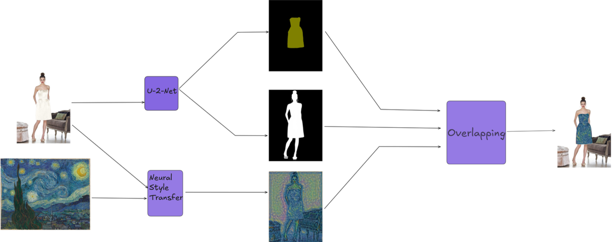
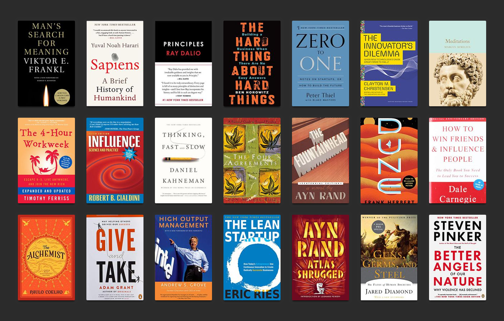
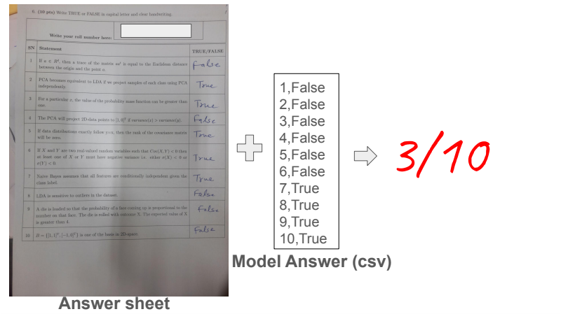

<!-- 🌌 ATHARVA DATE | IIT JODHPUR | AI + DATA SCIENCE -->

# ⚡️ **Atharva Date**
### *AI & Data Science Engineer | Researcher | Innovator*

🎓 Final Year @ IIT Jodhpur | 📊 AI • ML • Computer Vision • NLP  
🔭 Currently exploring **Table Question Answering**, **Graph-based RAG**, and **Reasoning Systems**  
💡 Passionate about building AI that blends science, creativity, and impact

---

  <video src="git_to_name_loop.mp4" autoplay loop muted playsinline width="500"></video>

## 🧠 **About Me**

> “Bridging ideas and intelligence — one model at a time.”

- 🔬 Working on **Table Question Answering Research** & **Retrieval-Augmented Generation**  
- 🤝 Open to collaborations in **Computer Vision**, **NLP**, **Data Engineering**, and **AI Research**  
- 🌱 Currently experimenting with multi-domain AI applications blending **ML**, **data systems**, and **knowledge reasoning**  
- ⚡ Fun fact: I love solving problems, sketching sci-fi art, and reading thought-provoking tech fiction.

---

## 💻 **Tech Arsenal**

| Cloud & DevOps | Programming | ML & AI Frameworks | Data & Visualization | Tools |
|-----------------|--------------|--------------------|----------------------|-------|
|    |    |    |    |    |

---

## 🚀 **Highlighted Projects**

> *Click the image to explore each repository.*

| Project | Description | Link |
|----------|--------------|------|
| 🧥 **Style Transfer in Fashion Images** | Virtual try-on using **U-2-Net**, **VGG-19**, and saliency-based blending. |  |
| 🧠 **Alex AI Assistant** | Modular local assistant for voice & text automation — plays music, manages files, fetches news. |  |
| 📚 **Book Recommendation System** | Personalized recommender with **Elasticsearch** and **KNN-based retrieval**. |  |
| ✍️ **Auto Handwritten Sheet Evaluation** | OCR + ML pipeline automating exam sheet grading with 89% validation accuracy. |  |
| 🌐 **Wikipedia RAG Prompt Generator** | Improves QA factuality by generating enhanced RAG prompts. |  |
| 🧩 **Retrieval Chatbot** | Retrieval-based chatbot for dynamic knowledge-driven conversations. |  |

---

## 📊 **GitHub Analytics**

---

## 🧩 **Core Skills**

- **Languages:** Python, C++, Java, Swift  
- **AI & ML:** Neural Networks, NLP, RAG, Vision Systems  
- **Data Engineering:** PostgreSQL, MongoDB, Big Data, Elasticsearch  
- **Software Dev:** DSA, Docker, API Development, CI/CD  
- **Cloud:** Azure, AWS, Firebase, Vercel  

---

## 🪄 **Let’s Build the Future**

> “AI isn’t replacing people — it’s amplifying what passionate builders can do.”

🌍 Let’s collaborate on something impactful — AI research, open-source innovation, or startup ideas.  
📬 Reach me at **[atharva.a.date@gmail.com](mailto:atharva.a.date@gmail.com)** or connect via [LinkedIn](https://linkedin.com/in/atharva-date-a956b6256).

---

  
✨ *Crafted with code, curiosity, and caffeine.* ☕  
© 2025 **Atharva Date**

