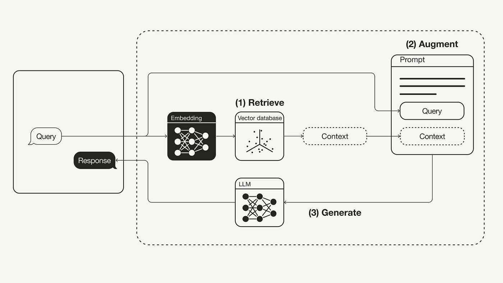
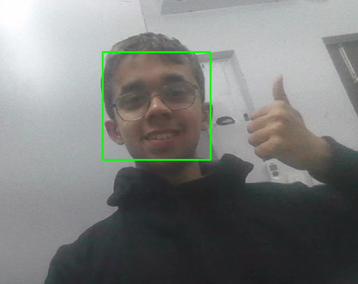

# Welcome ! ! !

I'm Atharva Date, a passionate sophomore at IIT Jodhpur studying Computer Science Engineering with a focus on AI and Data Science.

🤖I'm currently exploring the realms of machine learning and neural networks, constantly learning and growing.
💻 I enjoy solving challenging problems and building innovative projects that make a difference.

### 🚀 Project Highlights

#### RAG (Retrieval-Augmented Generation) Prompt Generator
From scratch RAG Prompt Generator improves question answering by generating prompts from context provided by the user.
 

#### Face Detection System with Webcam
Live face detection system implemented from webcam feed.
 

#### Computer Vision for Apparel Identification
Utilized computer vision techniques to identify various types of apparel.
 

#### Retrieval Chatbot with Custom Input
Developed a retrieval-based chatbot with customizable input for interactive conversations.
 

### 🛠️ Skills

- **Languages:** C, C++, Python, Java
- **Machine Learning:** ML models, Neural Networks
- **Data Structures & Algorithms:** Proficient in DSA
- **Web Development:** HTML, CSS, JavaScript

Let's connect and collaborate! Feel free to reach out via [email](mailto:b22ai045@iitj.ac.in) or connect with me on [GitHub](https://github.com/ADIITJ/).

