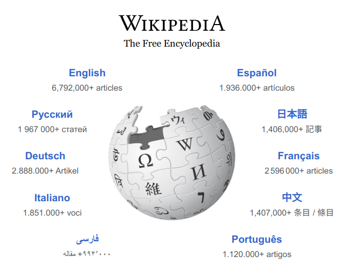

# Welcome ! ! !

I'm Atharva Date, a passionate sophomore at IIT Jodhpur studying Computer Science Engineering with a focus on AI and Data Science.

🤖I'm currently exploring the realms of machine learning and neural networks, constantly learning and growing.
💻 I enjoy solving challenging problems and building innovative projects that make a difference.

### 🚀 Project Highlights

| Project Name                                    | Description                                                                                                                           | GitHub Repository                                | Image                                            |
|-------------------------------------------------|---------------------------------------------------------------------------------------------------------------------------------------|--------------------------------------------------|--------------------------------------------------|
| Wiki-search to generate prompt with RAG         | Extracts information from top Wikipedia search results and feeds it into the RAG Prompt Generator.                                   | [GitHub Repo](https://github.com/ADIITJ/Wiki-search) |                         |
| RAG (Retrieval-Augmented Generation) Prompt Generator | Improves question answering by generating prompts from user-provided context, enhancing accuracy.                                | [GitHub Repo](https://github.com/ADIITJ/RAG-implementation) |                                  |
| Face Detection System with Webcam               | Implements a live face detection system using webcam feed.                                                                           | [GitHub Repo](https://github.com/ADIITJ/face_detection_webcam) |                      |
| Computer Vision for Apparel Identification      | Utilizes computer vision to identify various types of apparel.                                                                       | [GitHub Repo](https://github.com/ADIITJ/basic-computer-vision) |                  |
| Retrieval Chatbot with Custom Input             | Develops a retrieval-based chatbot with customizable input for interactive conversations.                                          | [GitHub Repo](https://github.com/ADIITJ/retrieval-chatbot) |            |

### 🛠️ Skills

- **Languages:** C, C++, Python, Java
- **Machine Learning:** ML models, Neural Networks
- **Data Structures & Algorithms:** Proficient in DSA

Let's connect and collaborate! Feel free to reach out via [email](mailto:b22ai045@iitj.ac.in) or connect with me on [GitHub](https://github.com/ADIITJ/).

