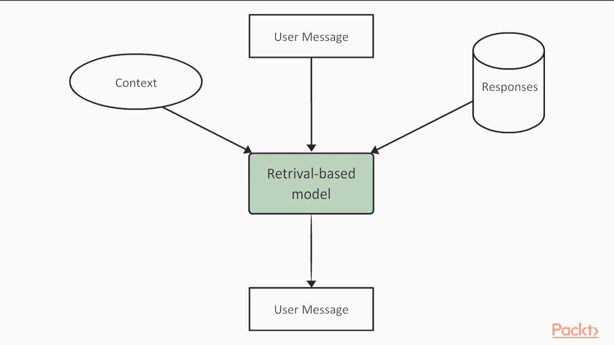

# Welcome ! ! !

I'm Atharva Date, a passionate sophomore at IIT Jodhpur studying Computer Science Engineering with a focus on AI and Data Science.

🤖I'm currently exploring the realms of machine learning and neural networks, constantly learning and growing.
💻 I enjoy solving challenging problems and building innovative projects that make a difference.

### 🚀 Project Highlights

| Project Name                                 | Description                                                                                     | Image with Link                                                                                             |
|----------------------------------------------|-------------------------------------------------------------------------------------------------|-------------------------------------------------------------------------------------------------------------|
| Wiki-search to generate prompt with RAG      | The project extracts pertinent information from the top three search results on Wikipedia, which is then fed into the RAG Prompt Generator(repo below)   |                                            |
| RAG (Retrieval-Augmented Generation) Prompt Generator | From scratch RAG Prompt Generator improves question answering by generating prompts from context provided by the user. Thus boosting accuracy. |                              |
| Face Detection System with Webcam            | Live face detection system implemented from webcam feed.                                         |                               |
| Computer Vision for Apparel Identification  | Utilized computer vision techniques to identify various types of apparel.                          |                            |
| Retrieval Chatbot with Custom Input          | Developed a retrieval-based chatbot with customizable input for interactive conversations.        |                         |

### 🛠️ Skills

- **Languages:** C, C++, Python, Java
- **Machine Learning:** ML models, Neural Networks
- **Data Structures & Algorithms:** Proficient in DSA

Let's connect and collaborate! Feel free to reach out via [email](mailto:b22ai045@iitj.ac.in) or connect with me on [GitHub](https://github.com/ADIITJ/).

